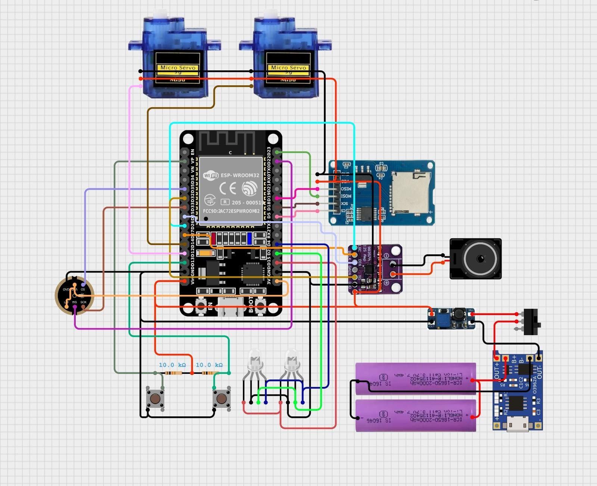
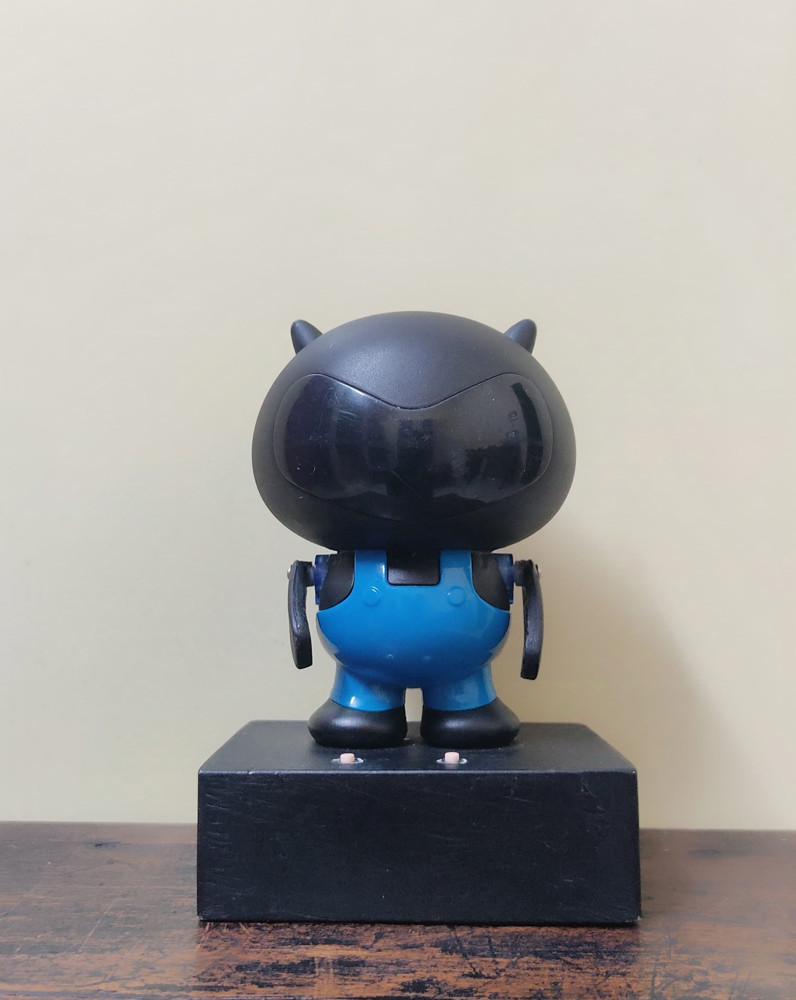

# Portable_Ai_Voice_Assistant_Robot with Gemini
A dedicated, low-cost AI voice assistant based on the ESP32 microcontroller. This project leverages the powerful Gemini AI model for intelligent conversation and query handling, along with Deepgram's speech-to-text API for seamless voice interaction. The integration of Gemini and Deepgram enables a responsive, interactive AI experience, while the ESP32 keeps the solution affordable and efficient.

# Features
- Offline wake word detection using the INMP441 I2S microphone (still in development, currently uses a push button)
- Push-to-Ask: Press a button to initiate voice commands.
- Records user queries and sends audio to Deepgram for speech-to-text processing
- Real-Time Responses: Utilizes the Gemini AI model for real-time question answering.
- Processes natural language queries using Gemini AI's API for intelligent conversation
- Converts deepgram's response to speech using Gemini for high-quality text-to-speech output
- Plays back the AI-generated voice response on the ESP32 using a MAX98357A I2S amplifier and speaker
- External SD Card Support: Stores longer queries and additional data.
- Repeat Button: Replay the previous answer.
- Designed for ease of assembly, utilizing commonly available components and Dupont connectors for testing and prototyping

# This voice assistant is still in active development. Current efforts are focused on:
- Designing mobile power supply 
- Wake word detection accuracy
- Decreasing latency

# Hardware
- Esp 32 doit devkit v1
- MAX98357 I2S 3W Class D Amplifier 
- INMP441  Microphone Module I2S
- Micro SD Card Module for audio storage
- SG 90 SERVO
- RGB led
- 134N3P 5V Step-Up Power Module
- TP4056 module
- 3.7v li-ion battery
- Push button 
- 10 k resistors 
- Slide swich

# Circuit Diagram
Here is a circuit diagram for the project:

# Getting Started
- Connect the hardware components as shown in the wiring diagram 
- Install the ESP32 Arduino core and required libraries
- Configure your WiFi, Gemini API, and DeepGram API credentials
- Flash the firmware to your ESP32
-Power up the device and test it by holding the button and speaking a question

# Final Model 
Here is a final model for the project:

